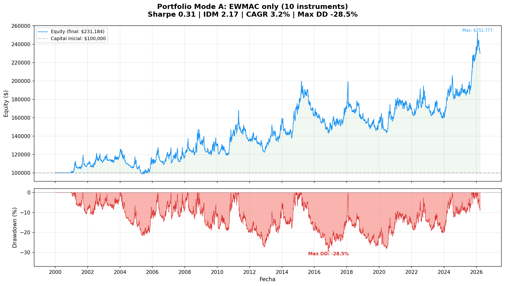
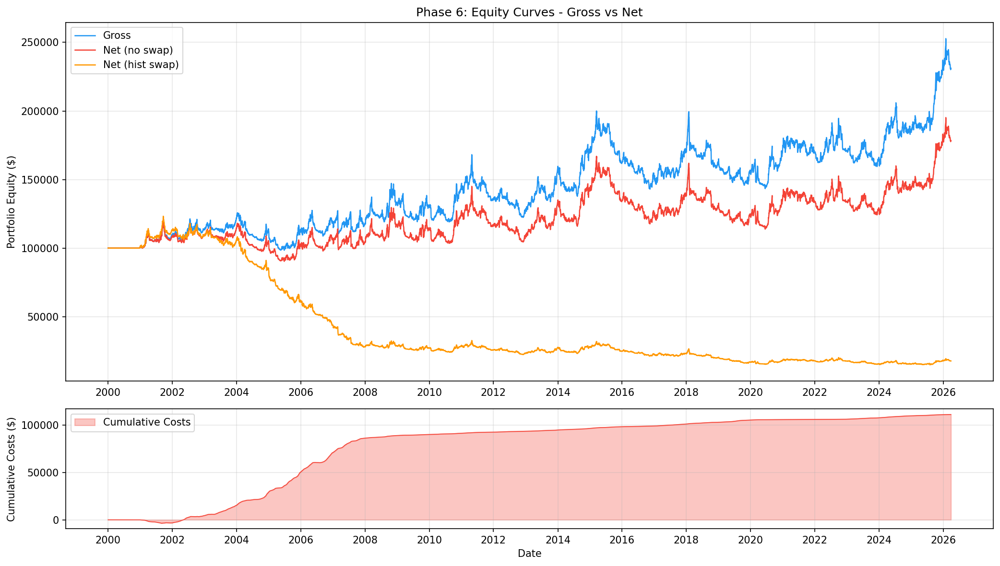
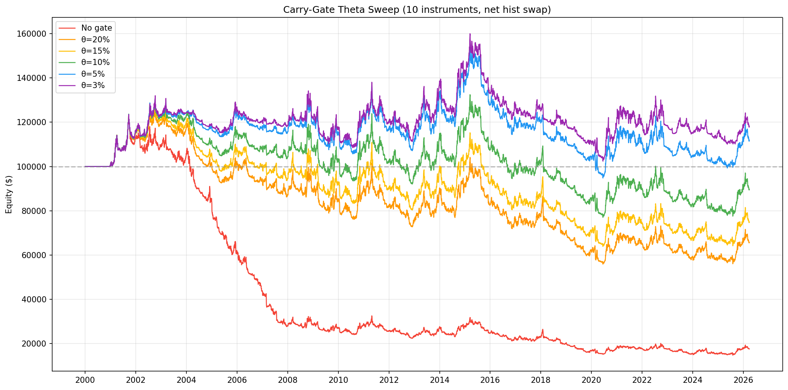

# Carver Systematic Trading — Applied to CFDs

> **Conclusion: EWMAC trend following on retail CFDs is not viable after swap costs.**
> This repository documents the complete research process — from successful gross backtesting to the definitive cost analysis that proved the strategy inoperable on CFDs.

Systematic portfolio trading system based on Robert Carver's *Advanced Futures Trading Strategies*, applied to 10 CFD instruments on Darwinex Zero. Daily timeframe, continuous position sizing via volatility targeting, zero optimized parameters — all values taken directly from published literature.

---

## The Story in Three Charts

### 1. The Promise — Gross Portfolio (Sharpe 0.31)

EWMAC trend following across 10 instruments produces a respectable gross equity curve over 26 years. Sharpe 0.31, CAGR 3.2%, Max DD -28.5%. The system works *before* costs.



### 2. The Problem — Swap Costs Destroy the Edge

Adding realistic CFD transaction costs (spread + commission + **daily swap**) reveals the core issue. The orange line shows cumulative swap costs exceeding $100K over 26 years — more than the initial capital. Swap alone turns +$130K gross profit into -$80K net loss.



### 3. The Definitive Test — Carry-Gate Cannot Save It

A "carry-gate" mechanism was developed to penalize positions during high-swap periods. Even at the most aggressive threshold (θ=3%, blocking up to 45% of trading days on some instruments), the best achievable Profit Factor is **1.014** — well below the 1.10 minimum for live trading.



---

## Final Results

| Scenario | Sharpe | CAGR | Max DD | Profit Factor | Verdict |
|----------|--------|------|--------|---------------|---------|
| **Gross (no costs)** | 0.314 | 3.2% | -28.5% | 1.07 | System has edge before costs |
| **Net (spread + commission only)** | 0.216 | 2.1% | -32.8% | 1.04 | Marginal without swap |
| **Net (full costs, no gate)** | -0.456 | -6.4% | -88.0% | 0.88 | Destroyed by swap |
| **Net (carry-gate θ=3%)** | 0.118 | 0.6% | -36.0% | 1.01 | Best case: still inoperable |

### Per-Instrument Net PnL (Best Case: θ=3%, 26 years)

| Instrument | Net PnL | Note |
|------------|---------|------|
| USDJPY | +$20,160 | Best performer (positive swap) |
| NIKKEI225 | +$15,133 | Genuine trend follower |
| NASDAQ100 | +$9,691 | Recovers with aggressive gate |
| SP500 | +$3,826 | Marginal positive |
| AUDUSD | +$929 | Breakeven |
| EURUSD | +$56 | Breakeven |
| GOLD | -$4,717 | Swap too high |
| DAX40 | -$5,977 | Trap: looks good gross, fails net |
| SILVER | -$10,496 | Chronic loser |
| GBPUSD | -$10,331 | Double-negative swap |

---

## Why It Fails (and Why This Matters)

Carver's framework was designed for **futures**, where:
- Holding costs are embedded in the price (contango/backwardation), not charged daily
- Transaction costs are a fraction of the daily range
- The edge-to-cost ratio is fundamentally different

On **retail CFDs**, the daily swap charge creates a structural drag that trend following cannot overcome. The strategy needs positions held for weeks/months to capture fat tails, but every day in a position costs money. This is not a parameter problem — it's a structural incompatibility.

### The Carry-Gate Innovation

We developed a continuous carry-gate penalty:

$$penalty = \max\left(0,\; 1 - \frac{|swap_{daily}|}{ATR_{daily} \times \theta}\right)$$

This scales down the forecast when swap costs are high relative to volatility. It recovered 0.57 Sharpe units (from -0.46 to +0.12) but the structural gap is too large for any filter to bridge.

---

## What Was Built

Despite the negative conclusion, the codebase implements a complete Carver system:

| Phase | Description | Status | Key Finding |
|-------|-------------|--------|-------------|
| **1** | Data pipeline (10 instruments, 26 years) | ✅ | Yahoo Finance daily OHLCV |
| **2** | EWMAC single-speed (64/256) validation | ✅ | Forecast ≈ N(0,10) confirmed |
| **3** | Multi-speed EWMAC (4 speeds + combination) | ✅ | FDM = 1.04 (Carver reference) |
| **4** | Carry signal investigation | ❌ | Discarded — no improvement over EWMAC |
| **5** | Portfolio + IDM (10 instruments) | ✅ | IDM = 2.17, Sharpe 0.31 gross |
| **6** | Transaction costs (time-varying swap) | ✅ | Swap destroys all edge |
| **6b** | Universe filtering + carry-gate | ✅ | Best PF = 1.014 — inoperable |

### Position Sizing Formula

$$Position = \frac{Forecast}{10} \times \frac{Daily\_Risk\_Target}{Daily\_Price\_Volatility \times Point\_Value}$$

Where:
- Forecast ∈ [-20, +20], scaled so |mean| ≈ 10
- Daily risk target = Capital × Annual vol target / √252
- Volatility estimated via exponential weighted std (span=25)

### Architecture

```
core/       - EWMAC forecasts, vol targeting, costs model, carry-gate
backtest/   - Pandas-based daily engine with dynamic capital
config/     - Instrument metadata + Darwinex CFD cost parameters
tools/      - Phase runners, data download, analysis scripts
data/       - Daily OHLCV from Yahoo Finance (not tracked)
analysis/   - Generated charts (not tracked)
images/     - README assets
```

## Key Design Principles

All from Carver's published work — **zero optimization**:

- **EWMAC forecast scalars** from Ch.15 lookup tables
- **Forecast Distribution Multiplier** (FDM) from Ch.15
- **Instrument Diversification Multiplier** (IDM) calculated from correlations
- **Equal weights** (1/N) across instruments and forecast speeds
- **10% position buffer** to avoid unnecessary adjustments
- **12% annual volatility target**
- **Mark-to-market capital** — positions scale with equity

## Instruments

SP500 · NASDAQ100 · DAX40 · NIKKEI225 · GOLD · SILVER · EURUSD · USDJPY · AUDUSD · GBPUSD

All via Darwinex Zero CFDs, daily timeframe, 2000–2026.

## Quick Start

```bash
pip install -r requirements.txt

# Download data (10 instruments)
python tools/download_data.py

# Run gross portfolio backtest
python tools/run_phase5_portfolio.py --save-only

# Run cost analysis with carry-gate theta sweep
python tools/run_phase6b_theta.py --save-only
```

## Lessons Learned

1. **Always model costs first.** A Sharpe 0.31 gross system can be Sharpe -0.46 net.
2. **Swap is the silent killer on CFDs.** It's not the spread or commission — it's the daily financing charge on held positions.
3. **Trend following needs cheap holding costs.** The strategy is designed for futures where cost-of-carry is priced into the contract, not charged as a daily fee.
4. **Carry-gate is a valid concept** but cannot overcome structural cost disadvantages. It's a filter, not a fix.
5. **Carver's framework is excellent** for risk management and position sizing — those components are reusable even if EWMAC on CFDs fails.

## References

- Carver, R. — *Advanced Futures Trading Strategies* (2023)
- Carver, R. — *Systematic Trading* (2015)
- [pysystemtrade](https://github.com/robcarver17/pysystemtrade) — Reference implementation

## License

MIT
