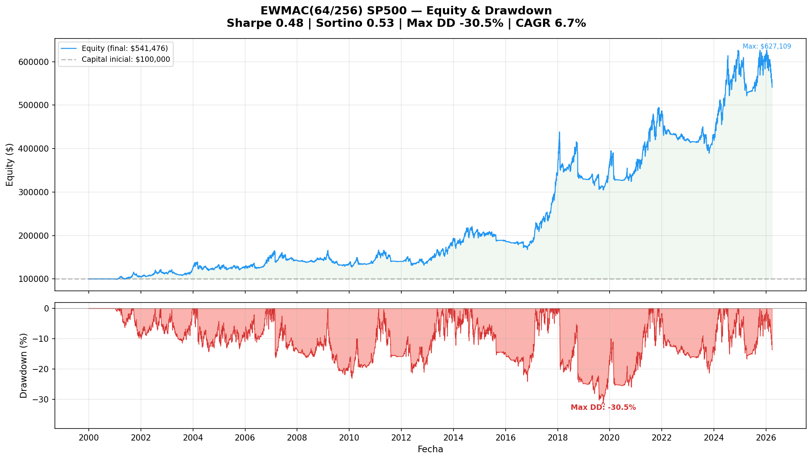
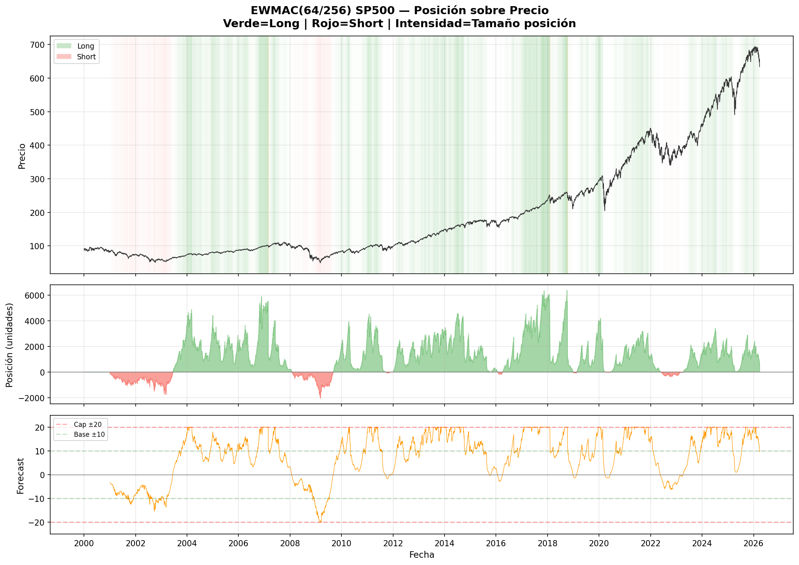
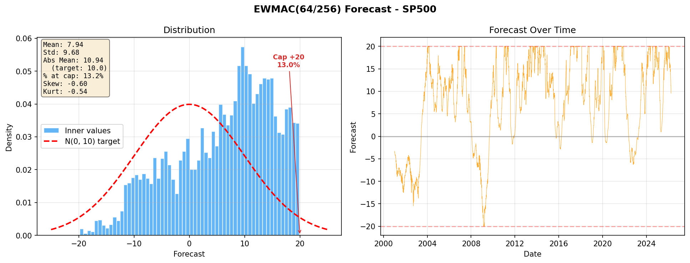

# Carver Systematic Trading

Systematic portfolio trading system based on Robert Carver's *Advanced Futures Trading Strategies*.

Multi-asset trend following + carry system operating on daily timeframe with **continuous position sizing** via volatility targeting. Zero optimized parameters — all values taken directly from published literature.

## Phase 2 Results — EWMAC(64/256) on SP500

> 26.2 years backtest (2000–2026) · $100K initial capital · **Gross returns (no costs)**

### Equity & Drawdown



### Position Overlay on Price



### Forecast Distribution



### Key Metrics

| Metric | Value |
|--------|-------|
| **Sharpe Ratio** | 0.48 |
| **Sortino Ratio** | 0.53 |
| **Calmar Ratio** | 0.22 |
| **CAGR** | 6.65% |
| **Annual Volatility** | 16.3% |
| **Max Drawdown** | -30.5% |
| **Profit Factor** | 1.09 |
| **Winning Years** | 15 / 27 |
| **Forecast Abs Mean** | 10.94 (target: 10) ✅ |
| **Forecast Std** | 9.68 (target: 10) ✅ |

## Key Principles

- **EWMAC** — Exponentially Weighted Moving Average Crossover for trend signals
- **Per-speed forecast scalars** from Carver Ch.15 (no optimization)
- **Volatility targeting** (12% annual) for position sizing
- **Buffering** (10%) to minimize unnecessary position adjustments
- **Forecast capping** at ±20 to limit extreme positions
- **Mark-to-market capital** — positions scale with equity

## Architecture

```
core/       - Forecast calculation (EWMAC scalars, vol targeting)
backtest/   - Pandas-based daily engine with dynamic capital
tools/      - Data download, Phase 2 runner with --save-only mode
analysis/   - Generated charts and adjustment logs (not tracked)
images/     - README assets (tracked)
data/       - Daily OHLCV from Yahoo Finance (not tracked)
```

## Instruments

SP500 · NASDAQ100 · DAX40 · NIKKEI225 · GOLD · SILVER · EURUSD · USDJPY · AUDUSD · GBPUSD

## Roadmap

- [x] **Phase 1** — Data pipeline (10 instruments, 20+ years daily)
- [x] **Phase 2** — Single EWMAC speed validation (64/256 on SP500)
- [ ] **Phase 3** — Multi-speed EWMAC (4 speeds + forecast combination)
- [ ] **Phase 4** — Carry signal
- [ ] **Phase 5** — Multi-instrument portfolio + IDM
- [ ] **Phase 6** — Transaction costs (spread, swap, commission)
- [ ] **Phase 7** — Paper trading via MT5
- [ ] **Phase 8** — Live trading

## Quick Start

```bash
pip install -r requirements.txt

# Download data (10 instruments)
python tools/download_data.py

# Run Phase 2 backtest with charts
python tools/run_phase2_ewmac.py

# Save charts without display
python tools/run_phase2_ewmac.py --save-only
```

## References

- Carver, R. — *Advanced Futures Trading Strategies* (2023)
- Carver, R. — *Systematic Trading* (2015)
- [pysystemtrade](https://github.com/robcarver17/pysystemtrade) — Reference implementation

## License

MIT
